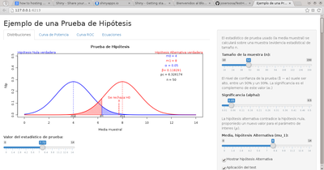
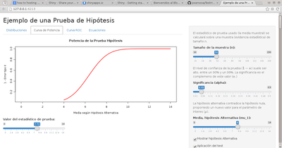
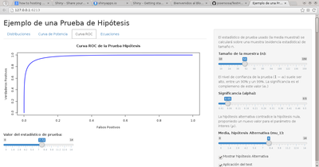
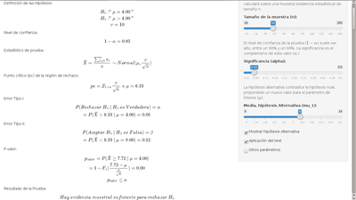

**Descripción**

Recurso digital para el aprendizaje del concepto de la prueba de hipótesis estadística.

[](images/distribuciones.png)

**Objetivo**

Esta aplicación intenta representar gráficamente los fundamentos de la toma de decisiones basadas en las pruebas de hipótesis estadística. En particular se muestra la relación entre las distribuciones de probabilidad del _estadístico de prueba_ para la media de una población con una hipótesis alternativa de cola derecha o izquierda, por ejemplo: **Ho:"mu=4"** y **H1:"mu>4"**

**¿Como ejecutar la aplicación?**

Este programa esta disponible en línea a traves de [josersosa.shinyapps.io/TestHipotesis](https://josersosa.shinyapps.io/TestHipotesis). También se puede ejecutar localmente en Rstudio. A continuación una ejemplo de como ejecutarlo desde el repositorio de _github.com_:

```{r}
library(shiny)
shiny::runGitHub('TestHipotesis', 'josersosa')
```

Para ver adecuadamente las ecuaciones, presione el botón **"Open in Browser"** en la parte superior de la aplicación. Pero si desea [descargarla](https://github.com/josersosa/TestHipotesis) y correrla localmente puede usar:

```{r}
library(shiny)
runApp('/ruta al directorio/TestHipotesis')
```

**Requisitos**

La aplicación está desarrollada en R, por lo que se requiere para su ejecución, tener instalado  ([el lenguaje R](https://cran.rstudio.com/)) y [RStudio](https://www.rstudio.com/products/RStudio/#Desktop). Adicionalmente se requiere la última versión del paquete _Shiny_ . Un ejemplo de como instalar este paquete:

```{r}
install.packages("shiny",dependencies=TRUE)
```

**Distribuciones**

La primera pestaña muestra un gráfico interactivo de las distribuciones de probabilidad asociadas con el estadístico de prueba según las Hipótesis Nula (H0) y la hipotesis Alternativa (H1). Los controles de la derecha permites cambiar el valor el tamaño de la muestra (n), el nivel de confianza y la propuesta de la hipótesis alternativa. Si coloca la media según H1 a la izaquierda de la propuesta de H0, entonces el problema se convierte en una prueba de hipótesis de cola izquierda.

**Curvas de evaluación de la prueba**

Se presentan dos pestañas adicionales con las gráficas interactivas de las curvas de potencia (1 - error de tipo 2 en funcion de H1) y la curva ROC (tasa de falsos positivos en función de la tasa de verdaderos positivos).

[](images/curva_potencia.png) [](images/curva_roc.png)

**Ecuaciones**

La última pestaña muestra las ecuaciones asociadas con el problema de prueba de hipótesis planteada. Las mismas se modifican automaticamente cuando cambian los parámetros del problema.

[](images/ecuaciones.png)
